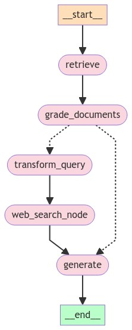

# CRAG Implementation README

## Overview
CRAG (Corrective Rag) is an innovative system designed to enhance document retrieval and response generation based on user queries. The system operates by extracting relevant chunks from a user query, assessing their relevance through a language model, and then processing these chunks to generate accurate and contextually relevant responses. The CRAG system integrates a two-step verification process for relevancy, followed by an optimization and search procedure for queries deemed irrelevant in their initial form.

## Features
- **Relevance Grading**: Utilizes a language model to grade the relevance of extracted chunks from the user query.
- **Query Optimization**: Optimizes user queries that are initially marked as irrelevant, enhancing the search for better results.
- **Document Retrieval**: Integrates web search capabilities for optimized queries to gather additional documents.
- **Response Generation**: Employs a RAG (Retrieval-Augmented Generation) chain to generate responses from the filtered relevant documents.

## System Workflow
1. **Chunk Extraction**: Extract relevant chunks from the user query.
2. **Relevance Determination**:
   - If relevant (`yes`), pass the chunks directly to the RAG chain for response generation.
   - If not relevant (`no`), optimize the query and perform a web search to gather more documents.
3. **Response Generation**: Use the RAG chain to generate a final response based on the documents deemed relevant.

[](output.jpeg)

## Installation and Setup

### Prerequisites
- Python 3.8 or higher
- pip
- Virtual environment (recommended)

### Setting Up the Environment
To set up and run the CRAG implementation, follow these steps:

1. **Clone the Repository**
   ```bash
   git clone https://github.com/shyamsundar009/rag---CRAG
   cd rag---CRAG
   ```

2. **Create and Activate a Virtual Environment**
   ```bash
   python -m venv venv
   source venv/bin/activate  # On Windows use `venv\Scripts\activate`
   ```

3. **Install Dependencies**
   ```bash
   pip install -r requirements.txt
   ```

4. **API Keys**
    Ensure you have the necessary API keys:
    - OpenAI API key for language model access.
    - Travily Search API key for web search capabilities.
    
    Use .env_template and insert the keys appropriately.     


### Running the Application
To run the Streamlit application:
```bash
streamlit run app.py
```